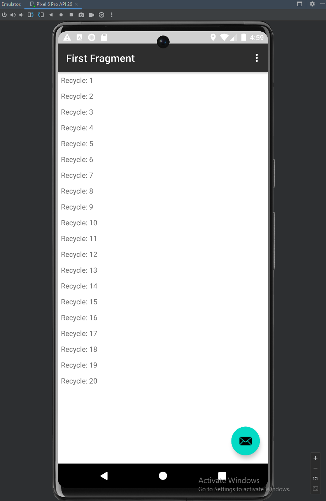
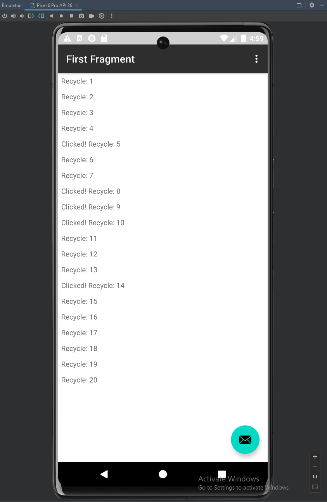

# RecyclerView

## APK File

### Path:

> CS374/recyclerview/apk/recyclerview.apk

## RecyclerView

This app implements Android Studio's RecyclerView as well as its own Adapter
and ViewHolder to be able to add items to the view (similarly to a ListView).

Instead of making an Empty Activity, we will make a Basic Activity with
fragments.

I've created my own adapter named "WordsAdapter" that creates and manipulates
"WordViewHolder" objects containing whatever we want in it (in this case TextViews).
Then, in our main activity, we will set our view adapter to WordsAdapter and create 
a LinkedList to hold our objects in the RecyclerView.

## Screenshots

### Initially

> 

### On click

> 